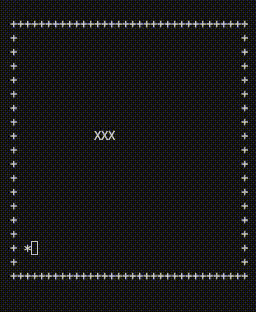

# 🐍 SnakeGame

> Bài tập Git — Lập trình game Snake theo nhóm

| | |
|---|---|
| **Môn học** | SS004 — Kỹ năng chuyên ngành |
| **Lớp** | SS004.F31.CN1.CNTT |
| **Nhóm** | SS004.9 · `uit-gam-huy-tu` |
| **Số thành viên** | 3 sinh viên |

---

## 📌 Liên kết

- **Repository:** [uit-26730027-lhhuy/SnakeGame](https://github.com/uit-26730027-lhhuy/SnakeGame)
- **Slack nhóm:** [uit-gam-huy-tu](https://ss004f31.slack.com/archives/C0BMAUUG2RJ)
- **Nhánh chính:** `main`

---

## 👥 Thành viên nhóm

| STT | MSSV | Họ và tên | Vai trò |
|:---:|:----:|-----------|---------|
| 1 | **26730027** | Lê Hoàng Huy | Nhóm trưởng |
| 2 | **26730014** | Nguyễn Thị Hồng Gấm | Thành viên |
| 3 | **26730078** | Nguyễn Quý Tứ | Thành viên |

---

## 📋 Mô tả dự án

Dự án xây dựng game **Snake** kết hợp thực hành làm việc nhóm với **Git / GitHub**:

- Quản lý mã nguồn tập trung trên repository
- Phân công, commit và merge theo nhánh
- Luyện kỹ năng cộng tác qua Pull Request / Code Review

### Demo

<p align="center">
  
</p>

---

## 🛠 Công nghệ

- **Ngôn ngữ:** C++
- **Công cụ:** Git, GitHub

---

## 🚀 Bắt đầu với Git

### Clone repository

```bash
git clone git@github.com:uit-26730027-lhhuy/SnakeGame.git
cd SnakeGame
```

### Quy trình làm việc đề xuất

1. Tạo nhánh mới từ `main` trước khi làm tính năng  
   ```bash
   git checkout -b feature/<ten-tinh-nang>
   ```
2. Commit thường xuyên với message rõ ràng  
   ```bash
   git add .
   git commit -m "mo ta thay doi"
   ```
3. Đẩy nhánh lên remote và tạo Pull Request  
   ```bash
   git push -u origin feature/<ten-tinh-nang>
   ```
4. Review → merge vào `main` → xóa nhánh đã hoàn thành

### Quy ước commit

| Prefix | Ý nghĩa | Ví dụ |
|--------|---------|--------|
| `feat:` | Thêm tính năng | `feat: them di chuyen ran` |
| `fix:` | Sửa lỗi | `fix: sua va cham tuong` |
| `docs:` | Cập nhật tài liệu | `docs: cap nhat README` |
| `refactor:` | Chỉnh lại code | `refactor: tach logic game` |
| `chore:` | Việc phụ (cấu hình, …) | `chore: them .gitignore` |

---

## 📁 Cấu trúc thư mục

```
SnakeGame/
├── README.md
├── assets/
│   └── demo.gif           # Demo gameplay
├── main.cpp               # Entry: tự chọn Windows / macOS
├── snake_windows.cpp      # Logic console cho Windows
└── snake_macos.cpp        # Logic console cho macOS
```

### Build & chạy

Chỉ cần biên dịch `main.cpp` — compiler sẽ `#include` đúng file theo hệ điều hành:

```bash
# macOS
clang++ -std=c++17 -o SnakeGame main.cpp && ./SnakeGame

# Windows
g++ -o SnakeGame.exe main.cpp
SnakeGame.exe
```
